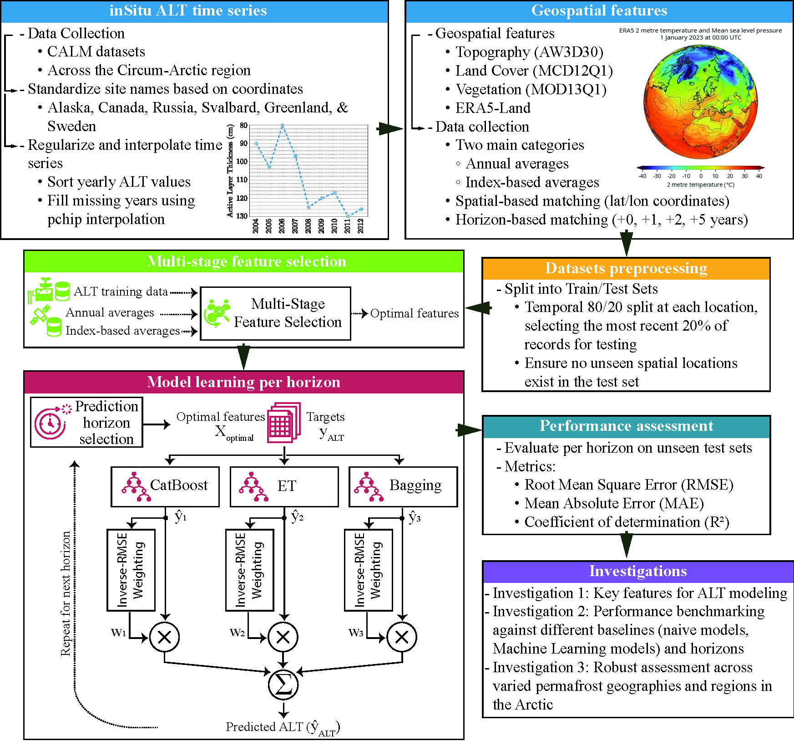

# Active Layer Thickness
This repository contains the code and data supporting the paper "Unfreezing the Future: Active Layer Thickness Prediction across Circum-Arctic Permafrost Regions Using Geospatial Machine Learning." The project introduces a machine learning framework for predicting Active Layer Thickness (ALT) at a circum-Arctic scale and up to five years ahead using a combination of remote sensing, reanalysis, and environmental datasets. It includes scripts for data preprocessing, feature selection, model training, evaluation, and visualization, along with data used to produce the results.

